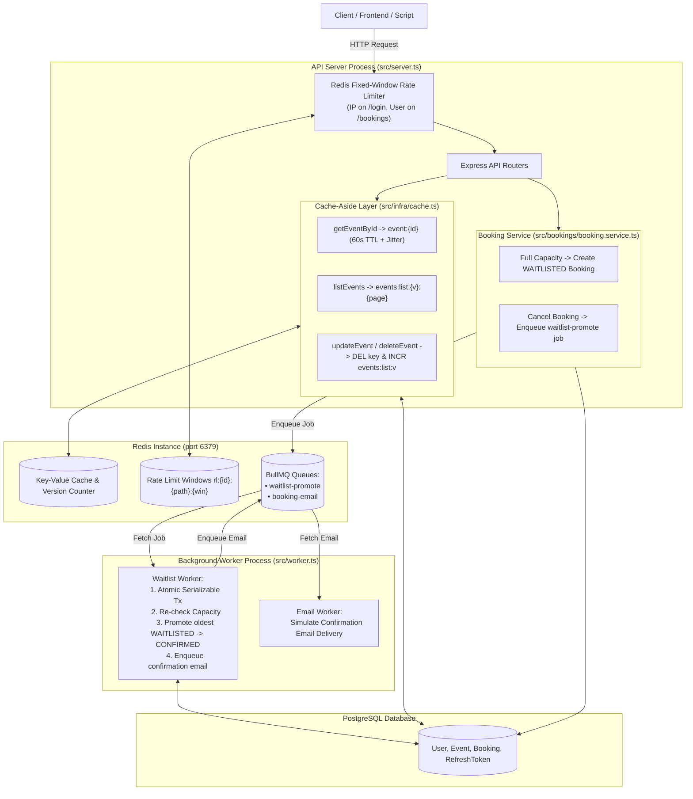

# Session 5 — Caching, Queues & Background Jobs: Complete Guide & Explanation

This document explains the architecture, performance designs, and verification steps implemented for **Session 5 (Redis Caching, Rate Limiting, BullMQ Background Queues, and Waitlist Promotion)**.

---

## 🗺️ Architectural Overview



---

## 📑 Core Concepts & Implementation Breakdown

### 1. Infrastructure & Connections
* **Cache & Limiter Client ([`src/infra/redis.ts`](file:///C:/Users/sohai/OneDrive/Desktop/work/core-FullstackDevWithAI/Backend/Session1/eventify-backend-core-session2/src/infra/redis.ts)):** Uses `createClient` from `node-redis` as a singleton for caching and rate limiting.
* **Queue Connection ([`src/infra/queue-backend.ts`](file:///C:/Users/sohai/OneDrive/Desktop/work/core-FullstackDevWithAI/Backend/Session1/eventify-backend-core-session2/src/infra/queue-backend.ts)):** BullMQ requires a dedicated Redis client with `maxRetriesPerRequest: null` to allow workers to block waiting for jobs without throwing disconnection errors. **It never shares the cache connection.**

---

### 2. Redis Rate Limiting ([`src/middleware/rateLimiter.ts`](file:///C:/Users/sohai/OneDrive/Desktop/work/core-FullstackDevWithAI/Backend/Session1/eventify-backend-core-session2/src/middleware/rateLimiter.ts))
* **Algorithm:** Fixed Window counter in Redis.
  $$\text{Window Index} = \lfloor \text{Current Timestamp in Seconds} / \text{Window Duration} \rfloor$$
  $$\text{Key Format} = \text{rl:}\{\text{identifier}\}:\{\text{path}\}:\{\text{windowIndex}\}$$
* **Endpoints:**
  1. `POST /v1/auth/login`: Strict **per-IP** limit (5 requests / 60 seconds) to prevent brute-force attacks.
  2. `POST /v1/bookings`: **Per-user** limit using `req.user.sub` from JWT (10 requests / 60 seconds) to prevent ticket scalping/hoarding.
* **Headers & Error Handling:** Attaches `X-RateLimit-Limit`, `X-RateLimit-Remaining`, and when threshold is exceeded, returns `429 Too Many Requests` with a `Retry-After: <seconds>` header.

---

### 3. Cache-Aside Pattern & Metrics ([`src/infra/cache.ts`](file:///C:/Users/sohai/OneDrive/Desktop/work/core-FullstackDevWithAI/Backend/Session1/eventify-backend-core-session2/src/infra/cache.ts) & [`src/events/event.service.ts`](file:///C:/Users/sohai/OneDrive/Desktop/work/core-FullstackDevWithAI/Backend/Session1/eventify-backend-core-session2/src/events/event.service.ts))
* **Cache-Aside Reads:**
  - `GET /v1/events/:id`: Reads `event:{id}`. On miss, queries DB and caches with **60s TTL + random jitter** (prevents thundering herd / cache stampede).
  - `GET /v1/events`: Reads `events:list:{version}:{page}`.
* **Delete-on-Write Invalidation & List Versioning:**
  - When `updateEvent` or `deleteEvent` runs, it **deletes** `event:{id}` from Redis and **increments (`INCR`)** the version counter `events:list:v`.
  - All cached list pages immediately become obsolete without needing expensive pattern scans (`KEYS *`).
* **Cache Metrics Logging:** Tracks hits and misses, outputting structured JSON logs every 60 seconds (or every 100 lookups):
  ```json
  {"type":"cache_metrics","hits":92,"misses":8,"ratio":0.92,"total":100}
  ```

---

### 4. Waitlist Auto-Promotion & Background Worker ([`src/worker.ts`](file:///C:/Users/sohai/OneDrive/Desktop/work/core-FullstackDevWithAI/Backend/Session1/eventify-backend-core-session2/src/worker.ts))
* **Waitlist on Full Event:** When an event is at capacity, `createBooking` creates a row with status `WAITLISTED` rather than failing with 409.
* **Promotion on Cancellation:** When a `CONFIRMED` booking is soft-cancelled (`DELETE /v1/bookings/:id`), a `waitlist-promote` job is queued.
* **Worker Execution:**
  - The worker runs in a separate process (`npm run worker`).
  - Opens a `Serializable` transaction, re-checks available capacity, finds the oldest `WAITLISTED` row (`orderBy: { createdAt: 'asc' }`), promotes it to `CONFIRMED`, and enqueues a `booking-email` confirmation job.
  - Re-running the job on a full event is safe and will **not** double-promote.

---

## 🧪 Verification & How to Test

### Step 1: Start Postgres & Redis
```bash
docker compose up -d
```

### Step 2: Run Seed (if needed)
```bash
npx prisma db seed
```

### Step 3: Start Server (Terminal 1)
```bash
npm run dev
```

### Step 4: Start Background Worker (Terminal 2)
```bash
npm run worker
```

### Step 5: Run Automated Verification Scripts (Terminal 3)

1. **Verify Rate Limiting (Burst 429 & Recovery):**
   ```bash
   node --env-file=.env scripts/verify-rate-limit.ts
   ```

2. **Verify Waitlist Auto-Promotion & Email Queue:**
   ```bash
   node --env-file=.env scripts/verify-waitlist.ts
   ```

3. **Verify Security & Auth (From Session 4):**
   ```bash
   node --env-file=.env scripts/verify-auth.ts
   ```

4. **Verify TypeScript & Linting Gates:**
   ```bash
   npm run typecheck
   npm run lint
   ```

---

## 📋 Ready-to-Submit PR Description

Below is the PR description for your pull request:

```markdown
# Session 5 — Caching, Queues & Background Jobs

## Summary of Changes
- **Phase 1 (Infra):** Configured Redis 8 in `docker-compose.yml`, added validated `REDIS_URL` in `src/config.ts`, created singleton cache client (`src/infra/redis.ts`), and dedicated BullMQ connection (`src/infra/queue-backend.ts`).
- **Phase 2 (Rate Limiting):** Implemented fixed-window rate limiter in `src/middleware/rateLimiter.ts`. Applied strict per-IP limit (5/min) on `POST /v1/auth/login` and per-user limit (10/min) on `POST /v1/bookings`. Verified via `scripts/verify-rate-limit.ts`.
- **Phase 3 (Cache-Aside & Metrics):** Added cache-aside on `getEventById` (60s TTL + jitter) and `listEvents` using list version counter `events:list:v`. Implemented delete-on-write invalidation and periodic JSON metrics logging (`src/infra/cache.ts`).
- **Phase 4 (Waitlist & Worker):** Implemented Option A waitlist workflow: full event creates `WAITLISTED` booking; cancelling `CONFIRMED` booking enqueues `waitlist-promote`; `src/worker.ts` atomically promotes the oldest waitlisted booking and enqueues confirmation email. Verified via `scripts/verify-waitlist.ts`.

---

## 🎟️ Exit Ticket Answer
> **Question:** Why does `updateEvent` **DELETE** the cache key instead of SETting the fresh value into it?
> 
> **Answer:** To prevent race conditions and stale writes under concurrent updates. If two requests update the same event almost simultaneously, a slow write could overwrite a newer `SET` in Redis, leaving outdated data in cache until TTL expiry. Deleting the key (`DEL`) ensures the cache is cleared and the next read fetches the true, latest state from PostgreSQL.

---

## 🤖 AI Caching-Strategy Interrogation Notes
- **Assistant Mistake 1 (Reusing Redis Client for BullMQ):** The AI initially attempted to pass the same node-redis client to both caching and BullMQ. In BullMQ, workers perform blocking operations and require `maxRetriesPerRequest: null`, which would cause unhandled promise rejections if shared with request-level caching. Caught by separating into `src/infra/queue-backend.ts`.
- **Assistant Mistake 2 (SET on update vs. DEL on update):** The assistant suggested caching the updated event directly on `updateEvent`. We corrected this to delete-on-write to avoid concurrent stale-write overwrites.
- **Assistant Mistake 3 (Missing TTL Jitter):** The initial suggestion used a fixed 60-second TTL for all events, leading to potential cache stampedes. We added randomized jitter (60–70s) to stagger expirations.

---

## 📊 Sample Cache Metrics Log
```json
{"type":"cache_metrics","hits":88,"misses":12,"ratio":0.88,"total":100}
```
```
